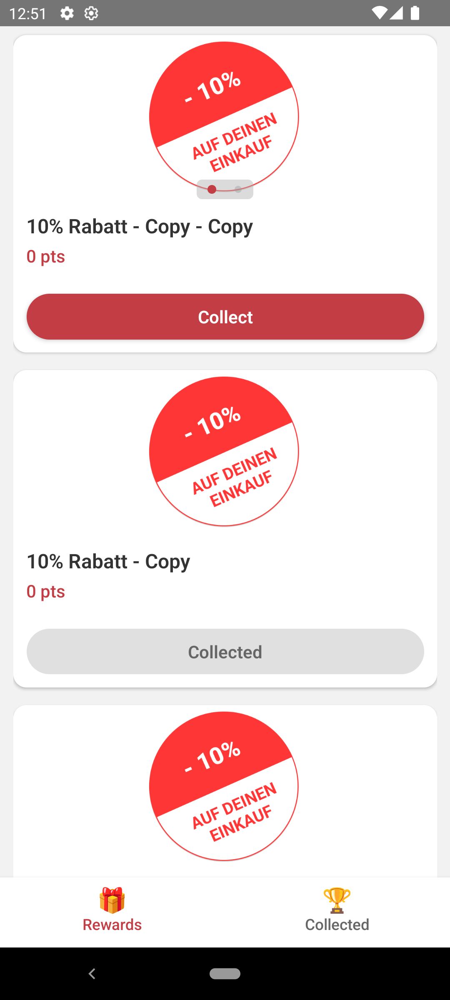
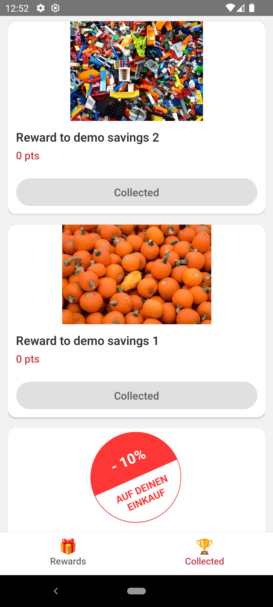

# Rewards App - React Native (TypeScript)

## Overview

A cross-platform React Native app for browsing and collecting loyalty rewards.

- Browse available rewards from the API.
- Collect rewards using a **Redux store**.
- View collected rewards in a separate tab.
- See reward images in a carousel with pagination indicators.

The app is built with **TypeScript**, **Redux Toolkit**, and **React Navigation**. Safe area boundaries, dynamic styling, and modular architecture are implemented.

---

Screenshots:
- Rewards List Screen

- Collected Rewards Screen


---

## Key Features

- Rewards List: paginated, handles loading/errors, shows only rewards with images, carousel for multiple images, Collect button

- Collected Rewards: displays collected rewards from Redux, empty state message if no rewards collected

- Navigation: bottom tabs with static emoji icons

- Safe Area: supports notches/status bars using `react-native-safe-area-context`

---

## Globalisation & Reusability

The app is designed for **easy reuse across multiple clients**:

1. **Base URL**
   - Stored in `src/constants/appConstants.ts`.
   - Can be changed to switch API environments (staging, production, etc.).

```ts
export const BASE_URL = "https://staging.helloagain.at/api/v1/clients/5189/bounties";
export const COLLECT_REWARD = "COLLECT_REWARD";
```

2. **Strings**
   - All UI text is centralized in `src/i18n/strings.ts`.
   - Easy to translate for different languages or clients.

```ts
export const strings = {
  rewards: "Rewards",
  collected: "Collected",
  noRewards: "No rewards collected yet",
  error: "Failed to load rewards",
};
```

3. **Colors**
   - Defined in `src/theme/colors.ts`.
   - Allows changing theme per client without touching components.

4. **Typography / Text Size**
   - Centralized in `src/theme/typography.ts`.
   - Can adjust font size for different clients or accessibility.

---

## Assumptions

- API responses always include `id` and `pictures` array.
- Only rewards with at least one valid picture are shown.
- Redux handles only **collected rewards**; no persistent storage implemented.
- App icons, emojis, and minimal libraries are used to keep app lightweight.

---

## Steps to Run / Test

### 1. Clone the Repository
```bash
git clone <repo-url>
cd rewards-app
```

### 2. Install Dependencies
```bash
npm install
```

### 3. Run Metro Bundler
```bash
npx react-native start
```

### 4. Run on Android
```bash
npx react-native run-android
```

### 5. Run on iOS
```bash
npx react-native run-ios
```

### 6. Notes
- Make sure you have Android Studio / Xcode configured.
- API base URL can be updated in `appConstants.ts` for different clients.

---

## Folder Structure

```
src/
├─ api/           # API calls
├─ components/    # Reusable components (RewardItem, CollectButton)
├─ navigation/    # AppNavigator (Bottom Tab)
├─ screens/       # RewardsListScreen, CollectedRewardsScreen
├─ store/         # Redux store & rewardsSlice
├─ theme/         # Colors & Typography
├─ types/         # TypeScript interfaces
├─ i18n/          # Strings for globalisation
├─ constants/     # Base URL, action constants
```

---

## Key Libraries Used

- `react-native-snap-carousel` → Image carousel with pagination
- `redux` & `@reduxjs/toolkit` → State management
- `react-redux` → Redux bindings
- `react-navigation` → Bottom tab navigation
- `react-native-safe-area-context` → Safe area handling


